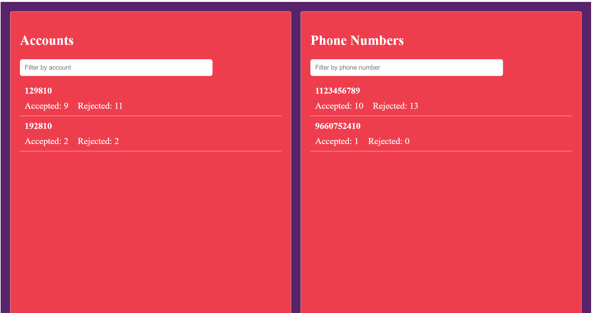

# Microservice Rate Limiter

This i a microservice in .NET Core (C#) that acts as a rate limiter. It enforces limits per-account and per-phone number.

It automatically clears data for accounts and phone numbers that have not been used for a period of 1 hour.

Runs on .NET 8 and Node 18.

### To run:
- Run `dotnet run` in the MessageRateLimiter directory to start the .NET service.
- Run `npm start` in the message-monitor directory to start the Angular application (or `ng serve`).

### Screenshot

### Notes:
- Made heavy use of Cursor.
- If anything is wonky it's probably because I deleted the entire codebase and restored it from dangling git blobs.